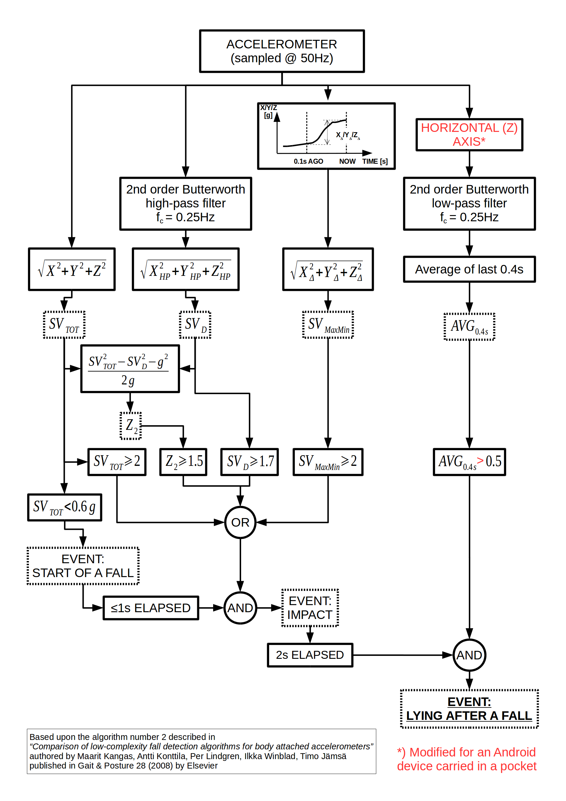

# Experimental Fall Detector Android App

## INTRODUCTION

In short: When a fall is detected the app calls the configured phone number.

## USER GUIDE

* Configure a phone number to call automatically when a fall is detected.
* Calls from that number will be answered automatically on speaker.
* An SMS from that number with the word POSITION in the content will be replied to automatically with the geographical position (if available).
* If the SMS contains the word ALARM instead, it will play back an alarm sound.
* The app will start automatically when the phone is turned on.
* It will also try to resist the attempts to terminate it.
* For optimal performance (to reduce the number of false alarms and the number of undetected falls) carry the device close to your waist (a trouser pocket, a belt clip, etc.).
* Keep your device charged at all times.

See the screenshots of [the main screen](doc/screenshot.1.png) and [the configuration screen](doc/screenshot.2.png). Install the app by clicking [here](fall-detector/build/outputs/apk/fall-detector-all-debug.apk)

## CREDITS

The fall detection is based upon the algorithm number 2 described in
*"Comparison of low-complexity fall detection algorithms for body attached accelerometers"*
authored by Maarit Kangas, Antti Konttila, Per Lindgren, Ilkka Winblad, Timo Jamsa
and published in Gait & Posture 28 (2008) by Elsevier (search for the paper [here](https://scholar.google.nl/scholar?hl=en&q=Comparison+of+low-complexity+fall+detection+algorithms+for+body+attached+accelerometers+Kangas+Konttila+Lindgren+Winblad+Jamsa))

