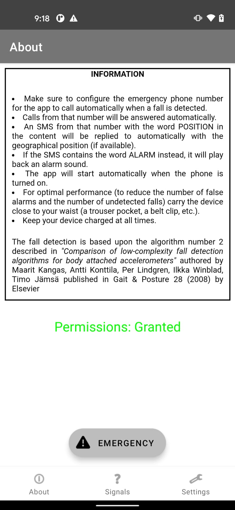
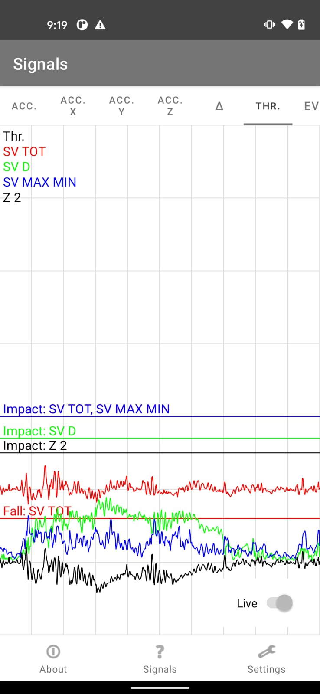
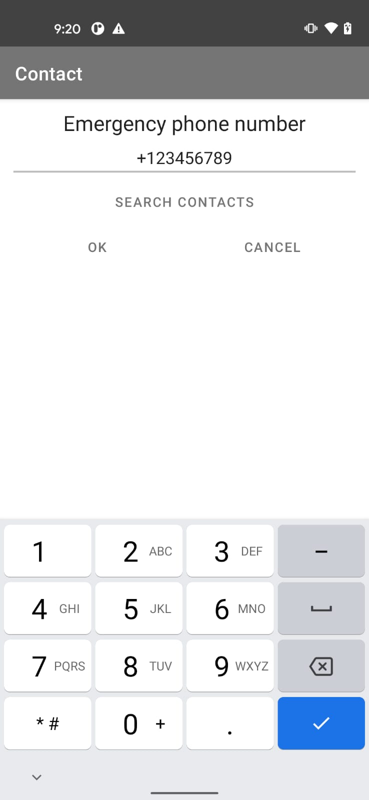

# Experimental Fall Detector Android App

## INTRODUCTION

In short: When a fall is detected the app will send an SMS to the configured emergency phone number.

## USER GUIDE

* Make sure to configure the emergency phone number for the app to call automatically when a fall is detected.
* Calls from that number will be answered automatically.
* An SMS from that number with the word POSITION in the content will be replied to automatically with the geographical position (if available).
* If the SMS contains the word ALARM instead, it will play back an alarm sound.
* The app will start automatically when the phone is turned on.
* For optimal performance (to reduce the number of false alarms and the number of undetected falls) carry the device close to your waist (a trouser pocket, a belt clip, etc.).
* Keep your device charged at all times.

Install the app by side-loading the APK file available [here](https://github.com/altermarkive/experimental-fall-detector-android-app/releases)
(you can find more info about the process [here](https://www.howtogeek.com/313433/how-to-sideload-apps-on-android/))

## SCREENSHOTS

 EULA screen (MIT license)     | About view (with instructions & emergency button) | Sensor & detection signals view (pausable & zoomable) | Settings view (to set emergency number & data collection) | Emergency number editor (with contact book lookup)
:-----------------------------:|:-------------------------------------------------:|:-----------------------------------------------------:|:---------------------------------------------------------:|:--------------------------------------------------:
  |                     |                       |                          | 

## CREDITS

The fall detection is based upon the algorithm number 2 described in
*"Comparison of low-complexity fall detection algorithms for body attached accelerometers"*
authored by Maarit Kangas, Antti Konttila, Per Lindgren, Ilkka Winblad, Timo Jamsa
and published in Gait & Posture 28 (2008) by Elsevier (search for the paper [here](https://scholar.google.nl/scholar?hl=en&q=Comparison+of+low-complexity+fall+detection+algorithms+for+body+attached+accelerometers+Kangas+Konttila+Lindgren+Winblad+Jamsa))

## 2021 UPDATE

The 2010 app was written in Java & C (both integrated via JNI and Android NDK) but I decided to port it to
Kotlin to learn the language on a practical example. A couple of other aspects had to be updated too,
including: permissions, image assets, deprecated APIs, theme, action layouts, Gradle files, etc.

The app has also a partially integrated collection of sensor data for research purposes.
